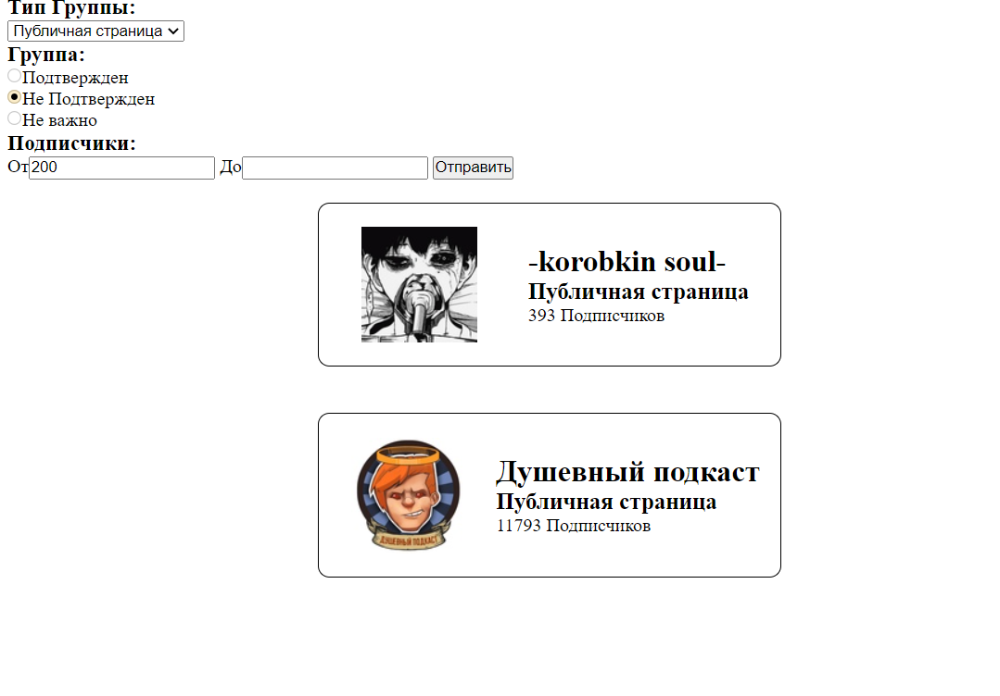

# Фильтр групп ВК
При создании использовались:
1. [Slim](https://www.slimframework.com/) 4.8
1. [phpdotenv](https://github.com/vlucas/phpdotenv) 5.3
1. [smarty](https://www.smarty.net/docsv2/) 3.19  
 За базовую структуру взят [Slim-Skeleton](https://github.com/slimphp/Slim-Skeleton). База данных не используется, ID групп хранятся локально. Вся остальная информация берется при помощи [VK API](https://vk.com/dev/manuals).
---
## Установка  
1. Установка нужных пакетов
```bash
composer install
```
2. Заполнение .env файла, шаблон лежит в корне (.env.example)
---
## Результат работы

---
## Работа

Список используемых групп находиться в файле [InMemoryGroupRepository.php](src/Infrastructure/Persistence/Group/InMemoryGroupRepository.php) он является локальным хранилищем, но может быть замененным на класс работы с БД, так как описывает интерфейс.  
[ListGroupAction.php](src/Application/Actions/Group/ListGroupAction.php) Обрабатывает запрос на получения списка групп и их фильтрацию.
Сама фильтрация происходит в отдельном модуле описанный интерфейсом [GroupRepository.php](src/Domain/Group/GroupRepository.php).  
Далее готовый массив групп передаться на отображение при помощи шаблонизатора [Smarty](https://www.smarty.net/docsv2/). Шаблон страницы находиться в папке [/Template](Template).

